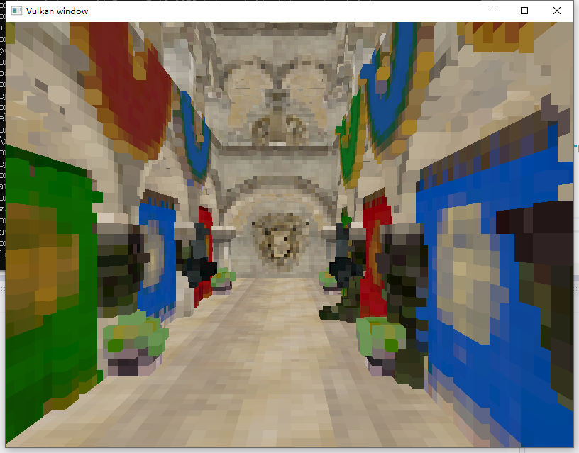
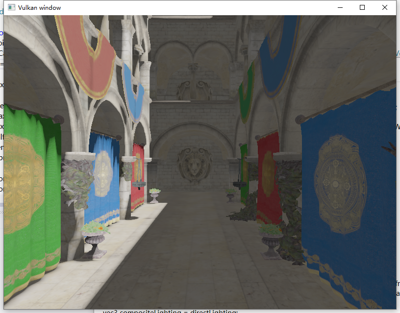
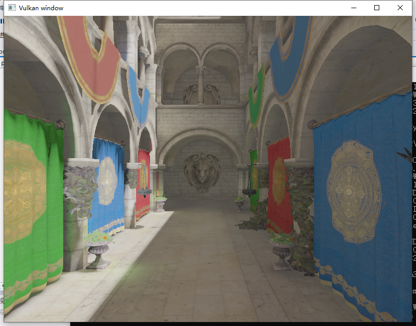
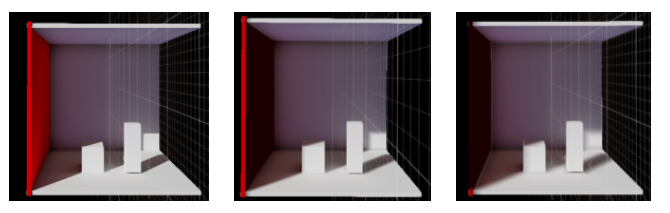

# TestRenderer
To implement some graphics algorithm and practice vulkan.
(The project and cmakelist has not been organized completely.)

- Voxel Cone Tracing
  - Voxelization
  

  - Without Indirect Lighting
  

  - With Diffuse Indirect Lighting
  

- Baking SDF Shadow(From UE4 LightMass)
  - And a PPT which analyzes the principle of this algorithm is in: Images/SDFShadow.pptx
  
